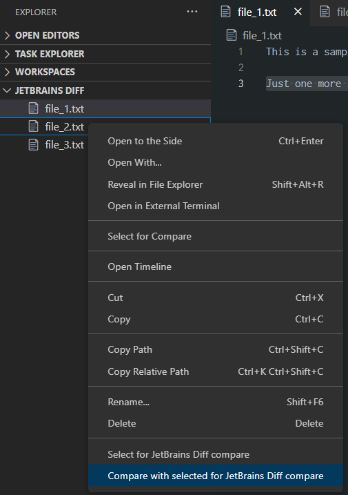
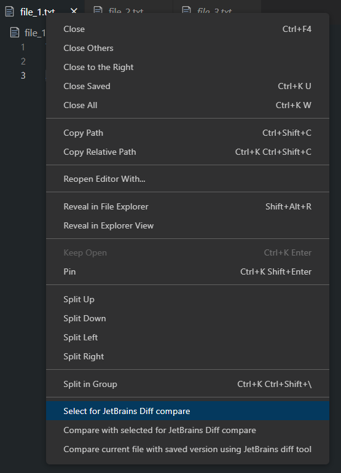

> **THIS IS A FORK OF https://github.com/danielroedl/vsc-meld-diff AND MOST OF THE CODE COMES FROM THERE.**
> **THE CODE WAS ALTERED TO WORK MAINLY WITH THE JETBRAINS DIFF TOOL.**

# Compare files, folders, clipboard or git changes with the JetBrains diff tool directly from vs code

This extension open two files (or folders), or a file with merge conflicts in the external tool by JetBrains. It is also possible to compare editor context or text selection with the clipboard or to use it with the git source control.

There are several commands to do different ways of comparing. It is also possible to choose the files (or folders) from the file list.

Hit `Ctrl` + `Shift` + `P` to open the command menu and type `JetBrains Diff`.


*Folder comparison is only possible from file list (see hint in command description `Select for JetBrains compare` and `Compare with selected for JetBrains compare`)*

**Important:**
Some JetBrains product must be available on your system.
On Windows you'll need to have a PATH variable set for the executable folder of the product.
If this is not possible the command can be changed to an absolute path (see [Customize settings](#customize-settings)).

It is also possible to change the compare tool, but keep in mind that the supplied arguments and their order are as follows (based on their respective git mergtool tokens)-
```"$LOCAL" "$REMOTE" "$BASE" "$MERGED"```
(see [Customize settings](#customize-settings)).

Table of contents:
- [Compare files, folders, clipboard or git changes with the JetBrains tool directly from vs code](#compare-files-folders-clipboard-or-git-changes-with-the-tool-jetbrains-or-other-like-winmerge-beyond-compare--directly-from-vs-code)
- [Detailed command information](#detailed-command-information)
  - [Compare all visible documents (two or three) using JetBrains](#compare-all-visible-documents-two-or-three-using-jetbrains)
  - [Compare current file with one other open file in editor using JetBrains](#compare-current-file-with-one-other-open-file-in-editor-using-jetbrains)
  - [Compare current file with one other file (not open in editor) using JetBrains](#compare-current-file-with-one-other-file-not-open-in-editor-using-jetbrains)
  - [Compare current file with saved version using JetBrains](#compare-current-file-with-saved-version-using-jetbrains)
  - [Select for JetBrains compare](#select-for-jetbrains-compare)
  - [Compare with selected for JetBrains compare](#compare-with-selected-for-jetbrains-compare)
  - [Compare with clipboard using JetBrains](#compare-with-clipboard-using-jetbrains)
  - [Open with JetBrains diff (git scm)](#open-with-jetbrains-diff-git-scm)
  - [Compare all selected files/folders using JetBrains](#compare-all-selected-filesfolders-using-jetbrains)
- [Usage with file list (also folder comparison possible)](#usage-with-file-list-also-folder-comparison-possible)
  - [Select for JetBrains compare](#select-for-jetbrains-compare-1)
  - [Compare with selected for JetBrains compare](#compare-with-selected-for-jetbrains-compare-1)
  - [Compare all selected files/folders using JetBrains](#compare-all-selected-filesfolders-using-jetbrains-1)
- [Usage with editor context menu](#usage-with-editor-context-menu)
- [Usage with editor title context menu](#usage-with-editor-title-context-menu)
- [Customize settings](#customize-settings)
  - [Use other tools than JetBrains](#use-other-tools-than-jetbrains)
  - [Don't delete temp files if visual studio code is closed before JetBrains](#dont-delete-temp-files-if-visual-studio-code-is-closed-before-jetbrains)

# Detailed command information
This chapter describes every command in detail.

## Compare all visible documents (two or three) using JetBrains
Up to three visible files can be compared with this command. To use it two or three files have to be visible side by side.


If there are more than three files visible the three files with the newest modification timestamp are used.

## Compare current file with one other open file in editor using JetBrains
The current selected file will be the first file for the comparison (left side in JetBrains diff tool).

The second file for the comparison (right side in JetBrains diff tool) is selected by menu which shows all open files.


## Compare current file with one other file (not open in editor) using JetBrains
The current selected file will be the first file for the comparison (left side in JetBrains diff tool).

The second file file for the comparison (right side in JetBrains diff tool) is selected by open file dialog.

## Compare current file with saved version using JetBrains
Compare the changed version in the current editor with it's saved version.

Change the contend in an editor and call the function. The changed content will be compared with the saved content in JetBrains.

This command is also available in the [editor title context menu](#usage-with-editor-title-context-menu).

## Select for JetBrains compare
Set the current selected file as the first file for the comparison (left side in JetBrains diff tool).

This command is also available in the [file list](#usage-with-file-list-also-folder-comparison-possible) (only if one element is selected) and the [editor title context menu](#usage-with-editor-title-context-menu).


## Compare with selected for JetBrains compare
Compare the current file (right side in JetBrains diff tool) with the file selected before by '*Select for JetBrains compare*'.

This command is also available in the [file list](#usage-with-file-list-also-folder-comparison-possible) (only if one element is selected and an element for JetBrains compare is selected before) and the [editor title context menu](#usage-with-editor-title-context-menu).



## Compare with clipboard using JetBrains
Compare the current file or the current selected text with the content of the clipboard.

1. Select text in an editor
2. Start '*Compare with clipboard*' from global menu or right click menu

If no text is selected the whole content of the editor is taken as selection.

If the selection is equal to the clipboard just a message will appear and no JetBrains tool is started.

If the selection is not equal JetBrains will be started comparing the saved file with the clipboard (not the maybe unsaved content).

This command is also available in the [editor context menu](#usage-with-editor-context-menu).

## Open with JetBrains diff tool
It is possible to open a diff or merge conflict of a file from the Source Control window with JetBrains (only for git).

Therefore the command '*Open with JetBrains diff tool' can be selected from the context menu.


All versions of the file that are not in the current workspace that are needed for the diff (e.g for diff of HEAD version to staged version) are only temporary and are deleted after JetBrains tool is closed.

## Compare all selected files/folders using JetBrains
Compare all in file list selected files or folder using JetBrains.

This option is only available in the file list and only if more than one file is selected.

**Command in context menu only available if multiple elements are selected in list!**

# Usage with file list (also folder comparison possible)
## Select for JetBrains compare
Select the first file or folder to compare (left side in JetBrains diff tool) by right click on file list and hit '*Select for JetBrains compare*'.


**Command in context menu only shown if one element is selected!**

## Compare with selected for JetBrains compare
Select the file or folder to compare to the file or folder selected before (right side in JetBrains diff tool) by right click on file list and hit '*Compare with selected for JetBrains compare*'.


**Command in context menu only if one element is selected and an element for JetBrains compare was selected before!**

## Compare all selected files/folders using JetBrains
See [Compare all selected files/folders using JetBrains](#compare-all-selected-filesfolders-using-jetbrains) above.

# Usage with editor context menu
The command '*Compare with clipboard*' is also available in the context menu of a text editor.


# Usage with editor title context menu
The commands '*Select for JetBrains compare*', '*Compare with selected for JetBrains compare*' and '*Compare current file with saved version*' are also available in the context menu of a text editor title.



# Customize settings
## Pick installed JetBrains product from list
A basic list of JetBrains products that you can pick from based on which product you have installed.
In order for this to work, a PATH variable of the bin directory of the chosen product needs to be set.

> Hint-
> The default directory route for JetBrains products on windows is:
> `C:\Program Files\JetBrains\<Product Name>\bin`

The default product is `IntelliJ IDEA`.

## Use other tools or an absolute path
In the settings for JetBrains Diff it is possible to customize the tool to use. Instead of IntelliJ IDEA/WebStorm/PyCharm, other JetBrains tools can be used, as well as other tools that accept a similar format.
Setting this field will override the software picked in the list.

## Don't delete temp files if visual studio code is closed before JetBrains tool
By default all temporary files created for comparison of unsaved files, selections and clipboard are removed on closing visual studio code. This is done even if JetBrains tool instances are running.

To prevent deleting of temp files that are used by JetBrains tool instances on closing visual studio code uncheck the settings entry `Temporary files (created for clipboard or unsaved comparison) are deleted if visual studio code is closed before the JetBrains tool`.
